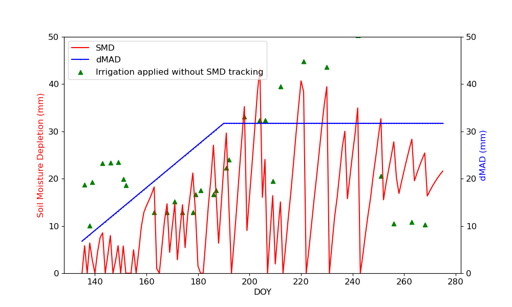
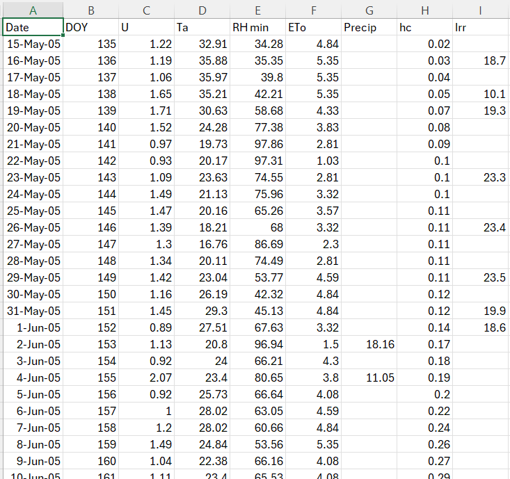

# Soil Moisture Balance Irrigation Model
This repository contains code and resources related to Soil Water Balance (SWB) Irrigation Management for the course `CIVE 519: Irrigation Water Management`. The focus of the project is on developing and analyzing irrigation scheduling and water use for agricultural crops using FAO 56 method.

  

## Project Description
The purpose of this repository is to provide scripts and data for managing soil water balance (SWB) model and irrigation scheduling for the effective management of water resources in agricultural settings. The project includes:

- Step-by-step codes to implement dual crop coefficient appraoch to estimate actual crop evapotranspiration (ETa).
- Estimation of daily soil water deficit and deep percolation.
- Irrigation scheduling recommendation using the dual crop coefficient approach.

## To install and run the scripts
To use the code in this repository, clone it to your local machine using Git:

git clone https://github.com/mdfahimhasan/SWB_Irr.git

To run the scripts - use the `SWB_driver.ipynb` file to run the model.

## Input data requirement and units 
The following variables are required as daily inputs for the model, and must be formatted as described below:  

  - `DOY (Day of the Year)`: Integer value representing the day of the year (1–365/366).  
  - `U (Wind Speed)`: Horizontal wind speed measured over a grass surface at a height of 2 meters above the ground, in meters per second (m/s). This should be the mean daily value.  
  - `Ta (Air Temperature)`: Mean daily air temperature in degrees Celsius (°C).  
  - `RH min (Minimum Relative Humidity)`: Mean daily minimum relative humidity value in percentage (%).  
  - `ETo (Reference Evapotranspiration)`: Grass reference evapotranspiration, in millimeters per day (mm/d).  
  - `Precip (Precipitation)`: Daily precipitation in millimeters (mm). If no precipitation is applied on a given day, this value should be set to 0 or the code will do that automatically.
  - `hc (Crop Canopy Height)`: Crop canopy height, in meters (m). This is a critical input that varies throughout the season.  
  - `Irr (Irrigation Water Depth)` Depth of irrigation water applied, in millimeters (mm). If no irrigation is applied on a given day, this value should be set to 0 or the code will do that automatically.

A sample input data file (.csv format) will look like this- 

## Dependencies
- pandas
- matplotlib

## Resources
Hoffman 2007 [Design and Operation of Farm Irrigation](https://books.google.com/books/about/Design_and_Operation_of_Farm_Irrigation.html?id=ldg2PQAACAAJ)

