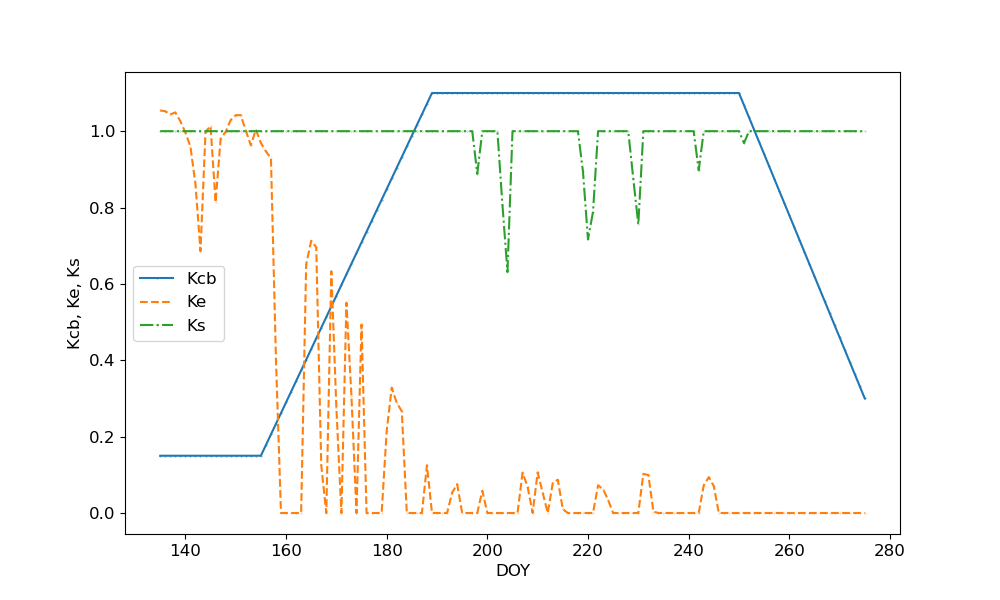
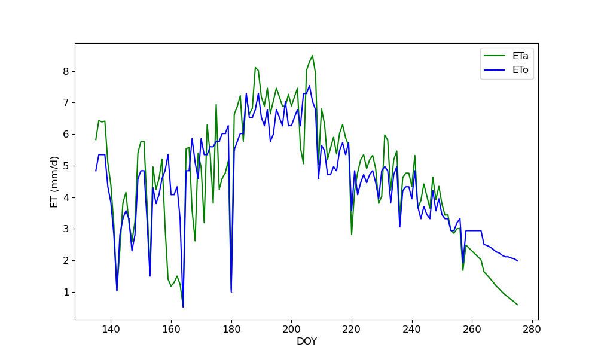

# Soil Moisture Balance Irrigation Model
This repository contains code and resources related to Soil Water Balance (SWB) Irrigation Management for the course `CIVE 519: Irrigation Water Management`. The focus of the project is on developing and analyzing irrigation scheduling and water use for agricultural crops using FAO 56 method.

  

## Project Description
The purpose of this repository is to provide scripts and data for managing soil water balance (SWB) model and irrigation scheduling for the effective management of water resources in agricultural settings. The project includes:

- Step-by-step codes to implement dual crop coefficient appraoch to estimate actual crop evapotranspiration (ETa).
- Estimation of daily soil water deficit and deep percolation.
- Irrigation scheduling recommendation using the dual crop coefficient approach.

## Installation and run the code
To use the code in this repository, clone it to your local machine using Git:

git clone https://github.com/mdfahimhasan/SWB_Irr.git

To run the scripts - use the `SWB_driver.ipynb` file to run the model.

## Dependencies
- pandas
- matplotlib

## Resources
Hoffman 2007 [Design and Operation of Farm Irrigation](https://books.google.com/books/about/Design_and_Operation_of_Farm_Irrigation.html?id=ldg2PQAACAAJ)

